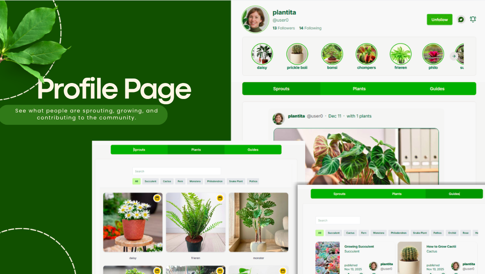
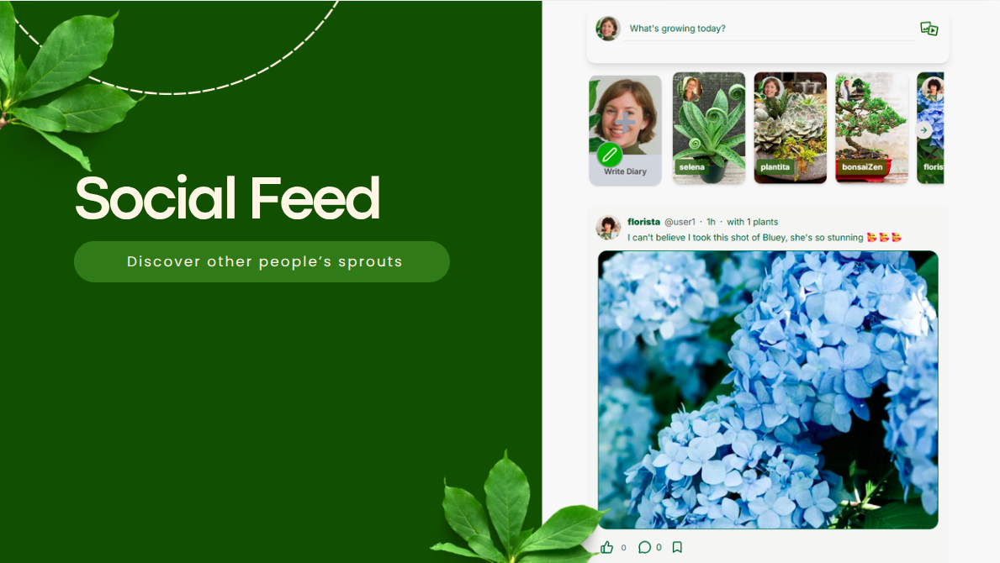
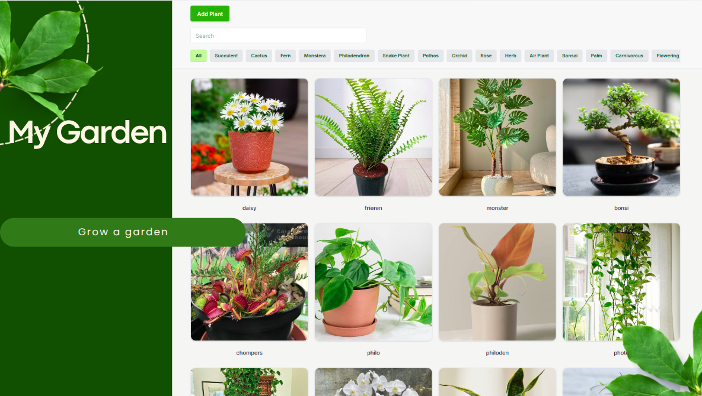
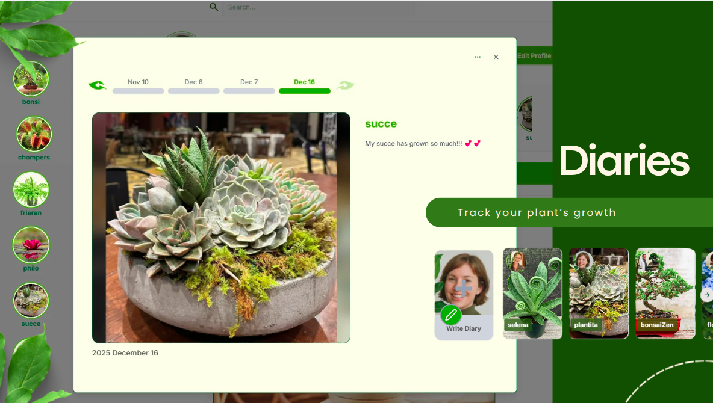
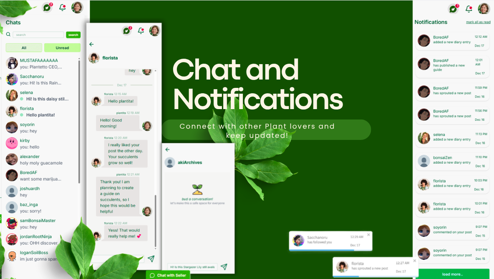
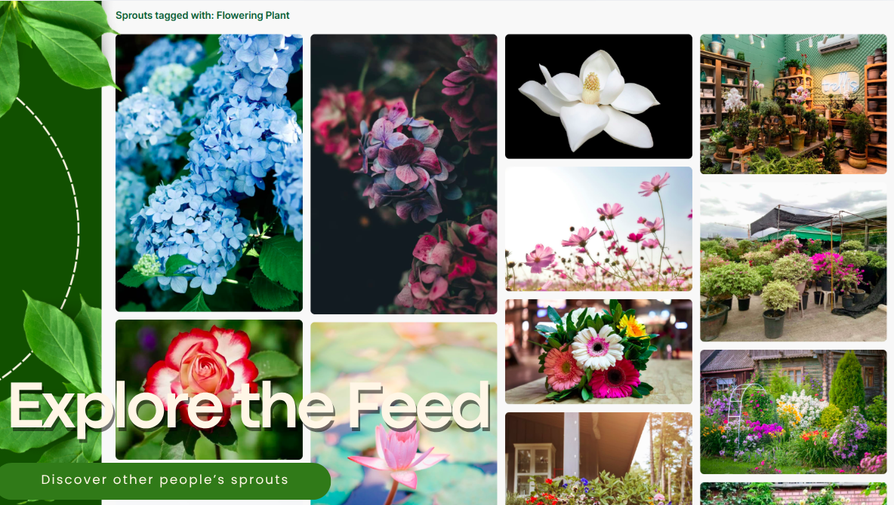
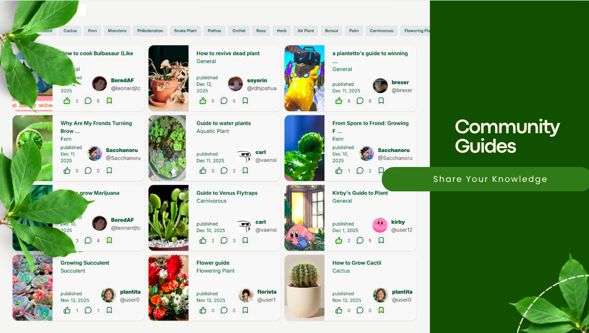

# Plantetto

**🌱 A Social Networking Web Application for Plantitos and Plantitas**

Developed by **[@esykeal](https://github.com/esykeal)**, **[@Hare-e](https://github.com/Hare-e)**, **[@Sacchanoru](https://github.com/Sacchanoru)** and me

## 🍈 Features

-   **User Profiles**
    Create and customize your own profile to showcase your plant journey.

-   **Posts**
    Create posts and share information about your plants with the community.

-   **My Garden**
    Keep track of your plants by adding them here.

-   **Plant Diaries**
    Create a Diary for your plants; similar to Instagram stories.

-   **Community Interaction**
    Engage with other users through posts, comments, reactions, and messaging.

-   **Plant Discovery**
    Explore plants shared by other plant enthusiasts.

-   **Plant Care Sharing**
    Exchange tips, care guides, and plant knowledge through community guides.

-   **Email Verification**

---

# Stack

React - frontend  
Flask - backend  
PostgreSql - database  
Cloudinary - cloud storage  
Resend - Email verification
